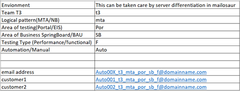

# PdcPortalMtaPolicies

### Description:
Policy data Creation for MTA automation is to be used for creation of policies through Echelon and registering them on portal
with default values passed through by a PdcPortalMtaPolicies.yaml file. This package will
help create set of policies for any environment where it is used.
This will help in new policies creation based on the inputus passed through the Yaml file.
The pre-requisite for this package is that the Client is already created either through ClientBuilder Package or manually.

### Installation
1. Tool required- IntelliJ Community Edition, Java Latest Version
2. Use mentioned path to find the runner: DataTools -> PolicyDataCreation -> PdcPortalMtaPolicies.yaml

### Usage
1. Yaml field details that need to be edited for this to take effect.
2. Number of policies required will be equal to instances in the yaml
3. Table of questions mapping to the keys in yaml will be provided to the user which needs to be
   updated based on the requirements. 
4. Detail needs to be modified before running the Yaml           
   ````
    ~Gen(DateOfBirth): DateRelToTodayAsStr|-14800|dd/MM/yyyy
   PostCode: XXX XXX 
   Password: ~(StandardPortalPassword) 
   Lastname: <Last name of client to be searched> 
   JointPolicyHolderDetails: true (In case Joint poicy holder is required)

5. Email address format explained with the table below-

   
   
### Meaning of keys in Yaml:

````yaml
      ~Stages:
        - ~Stage: #1 Create Quote on Echelon
            ~Activities:
              - ~Activity:
                  ~Label: CreateNewQuoteOnEchelon
                  ~Role: >
                    Create a new quote on Echelon UI
                  ~Type: Act
                  ~Action: QuoteCreationInEchelonUI
                  ~ControlData:
                     UserCredentials: #User Credentials
                        Email: #Email
                        Password: #Password   
                     SalesDetails:
                        QuotesDetails:
                           Affinity: Affinity
                           ~Gen(InceptionDate): DateRelToTodayAsStr|0|dd/MM/yyyy #Auto Generated
                        InsuranceDetails:
                           TypeOfHouseHoldCover:
                              Buildings: #true/false
                              Contents: #true/false
                              BuildingAccidentalDamage: #true/false
                              ContentAccidentalDamage:  #true/false
                           InsuredAmount:
                              BuildingVoluntaryExcess: #Number
                              ContentVoluntaryExcess: #Number
                              RebuildingCost: #Number input
                              ContentSum: #Number input
                           ContentDetails:
                              Safe: #true/false
                           BuildingDetails:
                              BuildingType: Detached  #Type of Building
                              ConstructionType: Standard  #Construction Type
                              YearBuilt: #Year
                              NumberOfBedrooms: #Number of Bedroom
                              Address:
                                 AddressSelector:
                                  HouseIdentifier: #House Number
                                  Postcode: #Postcode
                                 RiskAddress:
                                  HouseIdentifier: 1
                                  Postcode: #Postcode
                              AdditionalInformation:
                                 ListingStatus: #true/false
                                 BuildingWorkStatus: #true/false
                                 GoodRepairStatus: #true/false
                                 GeologicalThreats: #true/false
                                 FreeFromFloodingThreats: #true/false
                           Usage:
                              NonFamilyLodger: #true/false
                              LetWithSublet: #true/false
                              BusinessUse: #true/false
                              HolidayHomeStatus: #true/false
                              Occupancy: Occupied
                           Security:
                              Locks: #true/false
                              Alarms: Basic DIY Alarm  #Type of alarn
                              NeighbourhoodWatch: #true/false
                           ProposerRelationshipToRisk:
                              LegalRelationship: Owned #Leased/Rented/Owned
                              FirstTimeBuyers: #true/false
                           PreferredDeliveryMethod: #Email/Download
                           ProposerPersonalDetails:
                              Title: #Salutation Mr/Mss etc
                              FirstName: DataBuild
                              LastName: ~(AreaOfTesting)~(LogicalPattern)~(ClientGroupId)~(Index) - Auto Generated
                              MaritalStatus: Single  #Divorced/Married/Single/Civil Partnered/Widowed
                              ~Gen(DateOfBirth): DateRelToTodayAsStr|-14800|dd/MM/yyyy #39 years Old - Auto Generated
                              Gender: Male # Male/Female
                              ~Gen(UkResidentSince): DateRelToTodayAsStr|-14800|dd/MM/yyyy #39 years Old - Auto Generated
                              PrimaryEmploymentStatus:
                                 Employed: #true/false
                                 Category: Employee
                                 Type: BakeryAssistant
                                 Industry: FastFood
                              SecondaryEmploymentStatus:
                                 Employed: false
                           ProposerContactDetails:
                              AddressSelector:
                                 HouseIdentifier: 1
                                 Postcode: #Postcode
                              MainTelephoneNumber: # Telephone number
                              EmailAddress: ~(TestingTeam)_~(EmailSequenceNumber)_~(Team)_~(LogicalPattern)_~(AreaOfTesting)_~(AreaOfBusiness)_~(TestingType)@~(DomainName) - Auto Generated
                           MarketingChoice:
                              Postal: #true/false
                              Email: #true/false
                              Telephone: #true/false
                              SMS: #true/false
                           OtherDetails: #Policy User Fields
                              SufferedLossNotResultedInClaim: #true/false
                           DynamicUnderwriterQuestions:
                              WallConstructionType: Brick
                              RoofConstructionType: Concrete
                              NumberOfDaysPropertyLeftUnoccupied: #How long is the property left unoccupied?
                              PercentageOfFlatRoof: 35 # Number upto 100 - Approximately what percentage of the roof is flat? 
                              PaymentType:  #Payment Type?
                              UnsatisfiedCountyCourtJudgements: #Has any resident had any unsatisfied County Court Judgements?
                              ResidentDeclaredBankrupt: #Has any resident been declared bankrupt?
                              ExtendedHouse: #Has the property been extended? *
                              NumberOfPeopleLive:
                                 Children: #How many children live in the property?
                                 Adult: #How many adults live in the property?
                                 Pet: #Do you have a pet living at the property? *
                                    Cat: #true/false
                                    Dog: #true/false
                                    Other: #true/false #if first two options are true then other should not be true. condition
                              PropertyOwned: #How is your property owned?
                           JointPolicyHolderDetails: #true/false
                           JointPolicyHolder:
                              Title: #Mr
                              FirstName: #First Name
                              LastName: #Last Name
                              MaritalStatus: #Single / Divorce
                              ~Gen(DateOfBirth): DateRelToTodayAsStr|-12800|dd/MM/yyyy #Auto Generated
                              Gender: Male  #Male/Female
                              ~Gen(UkResidentSince): DateRelToTodayAsStr|-12800|dd/MM/yyyy #Auto Generated
                              RelationshipWithPolicyholder: (None) #(None), Single etc
                              
                  ~Unconditionals:
        - ~Stage: #2 Pay for the quote and generate policy number
            ~Activities:
              - ~Activity:
                  ~Label: CreateNewPolicyOnEchelon
                  ~Role: >
                    Capture policy details from portal before MTA
                  ~Type: Act
                  ~Action: PolicyCreationOnEchelonUI
                  ~ControlData:
                    UserCredentials: # User Credentials
                    SearchCriteria:
                      ClientNumber: # Client number input from Stage 1 
                    QuoteDetails:
                      CreditCardDetails: #Need to discuss As of now there is no option to add card detals
                        CardNumber: #Test card details: 4444333322221111
                        ExpiryDate: #03/2028
                        CVV: #555
                  ~Judgements:
                  ~Unconditionals:
        - ~Stage: #3 Register the new policy on portal
            ~Activities:
              - ~Activity:
                  ~Label: Register New User
                  ~Role: >
                    Validate new policy can be registered on the portal
                  ~Type: Act
                  ~Action: RegisterNewUser
                  ~ControlData:
                    NewRegistrationDetails:
                      Email: # Email Id used for registeration. Input from stage 2
                      Password: # Portal password
                      PolicyNumber: # Input from stage 2 PolicyNumber
                      DateOfBirth: #~(DateOfBirth) - input from instance section 
                      Postcode: # ~(PostCode) - input from instance section 
                  ~Judgements:
                    #- RegistrationStatus==false|HardRunFault("Home policy is not registered")
                  ~Unconditionals:
````
